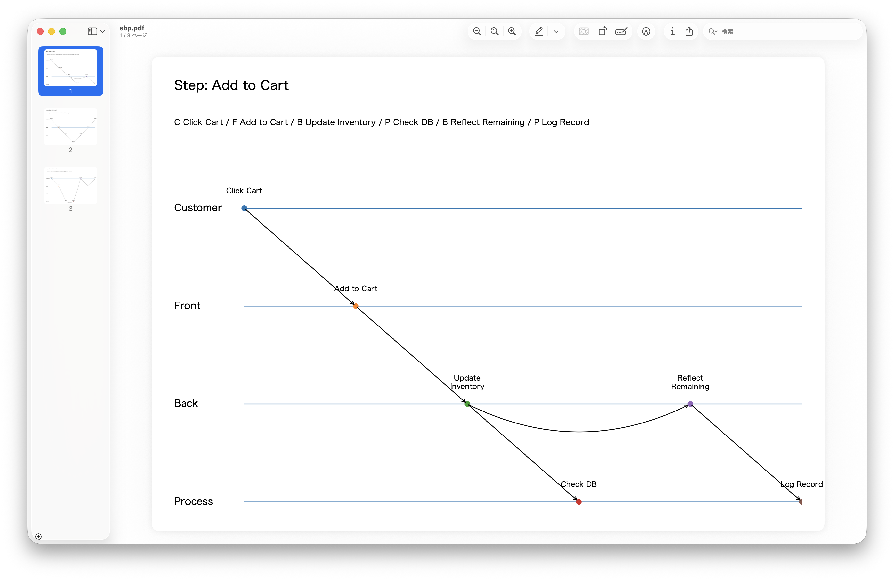

# sbpgen

Service Blueprint Generator with simple swimlanes for Text-based Workflows.



## Requirements

- Python 3
- matplotlib
    - pip3 install matplotlib


## Service Blueprint Format

example.txt

```
Add to Cart:C Click Cart/F Add to Cart/B Update Inventory//P Check DB|B Reflect Remaining/P Log Record
Example Step 1:C Action1/F Action2/B Action3/P Action4/B Action5/F Action6/C Action7
Example Step 2:C Action1/F Action2/P Action3/P Action4/C Action5/F Action6/C Action7
```

Format

```
[Step]:[Action abbreviations] [Action]/[Action abbreviations] [Action]/...
```

Action abbreviations

- C is Customer
- F is Front
- B is Back
- P is Process

Separater

- : is Step Separater
- / is Line
- // is Two-way Lines
- | is No Line

## Usage

```
python3 sbpgen.py example.txt sbp.pdf
```


## License

MIT
